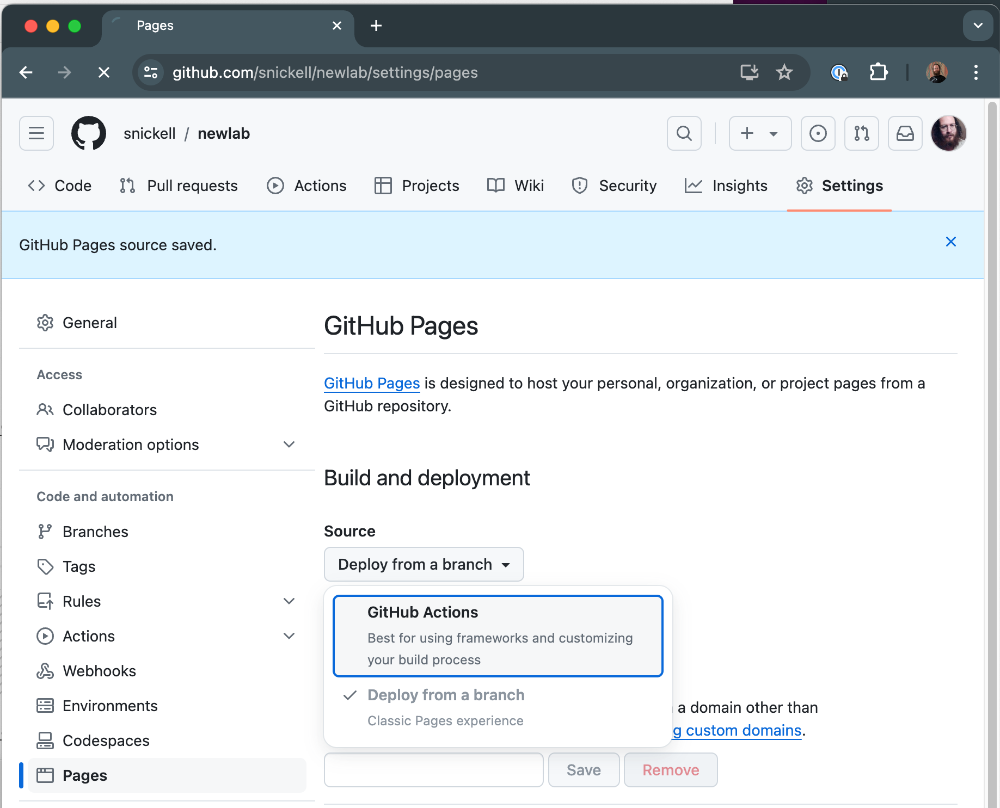

# Protolab

To start the dev server: `yarn dev`, then open http://localhost:9001

## Building a Protolab

Lets say you'd like to prototype a new protolab called `newlab`:

1. **Fork Protolab** to your GitHub account
   1. Open: https://github.com/code-dot-org/protolab, click the Fork button
   1. Select yourself as the owner, repository name: `newlab`, click Create Fork
   1. After the fork completes, you'll be taken to your new GitHub repo: https://github.com/username/newlab

1. **Enable GitHub actions**, to automatically build your repo on push
  

1. **Enable GitHub Pages**, by setting Deployment Source to Github Actions
  

1. **Create a codespace** or clone locally
  

1. **Make a source change**
   1. Edit `src/Lab.tsx` and change `LAB_NAME` to `newlab`
   1. Commit the change, and push it back to your repo
   1. GitHub Actions will build on push, you can find active builds at: https://github.com/username/newlab/actions
   1. About 1 minute later, you can **view your changes** on: https://username.github.io/newlab

1. When you're ready to collaborate with others, **Fork Protolab** back to the code-dot-org organization